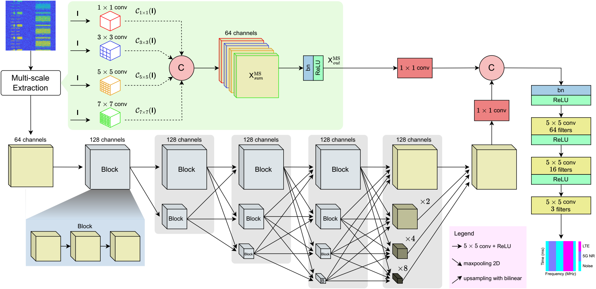

# A Resolution-Preserving Multi-Scale Network For Spectrogram-based Semantic Segmentation of 5G-LTE Signals in Spectrum Sensing

In this paper, we propose a novel semantic segmentation model designed to enhance the accuracy of 5G New Radio (NR) and Long-Term Evolution (LTE) signal segmentation in spectrogram images for intelligent spectrum sensing. To address the challenge of preserving essential signal information in spectral feature learning, we developed Resolution-Preserving Multi-Scale Network (RPMSN), an effective deep network architecture for semantic segmentation. This model maintains input resolution and extracts features at multiple scales by exploiting two components: a resolution-preserving architecture and a multi-scale block, consequently making it particularly effective for segmenting wideband spectrograms. In addition to significantly outperforming several state-of-the-art architectures, including U-Net, U-Net++, DeepLabV3, DeepLabV3+, FPN, and PSPNet, RPMSN achieved impressive performance with a mean accuracy of 97.22%, mean IoU of 95.42%, mean F1 Score of 97.64% under the presence of different channel impairments while keeping the model size efficient at 14.5M parameters.

The Python code and dataset provided here are part of the accepted paper in the Proceedings of the 19th International Conference on Ubiquitous Information Management and Communication (IMCOM), Bangkok, Thailand, January 2025.

Huu-Tai Nguyen, Hai-Trang Phuoc Dang and Thien Huynh-The, "A Resolution-Preserving Multi-Scale Network for Spectrogram-Based Semantic Segmentation of 5G-LTE Signals in Spectrum Sensing," Proc. IMCOM, Bangkok, Thailand, Jan. 2025, pp. 1-6, doi: 10.1109/IMCOM64595.2025.10857521. [[Link](https://ieeexplore.ieee.org/abstract/document/10857521)]

The dataset can be downloaded from [Kaggle](https://www.kaggle.com/datasets/huutai23012003/spectrum-sesing-dataset/data). Please report if it is not available.

If there are any errors or topics that need to be discussed, please contact [Huu-Tai Nguyen](https://github.com/huutai231) via email at n.huutai231@gmail.com.
